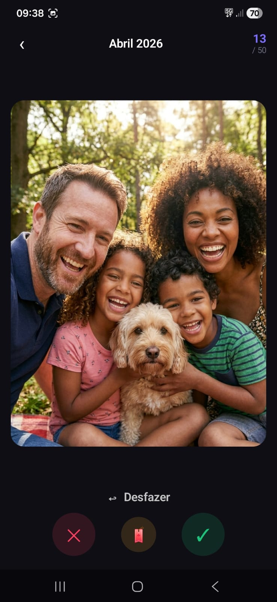
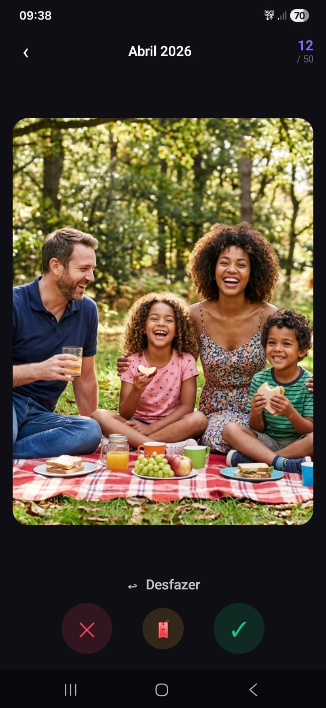
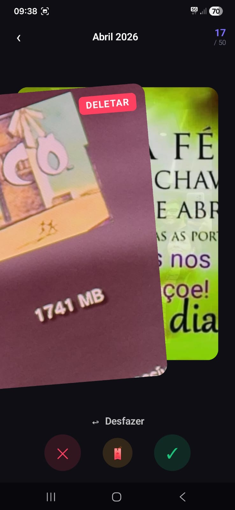
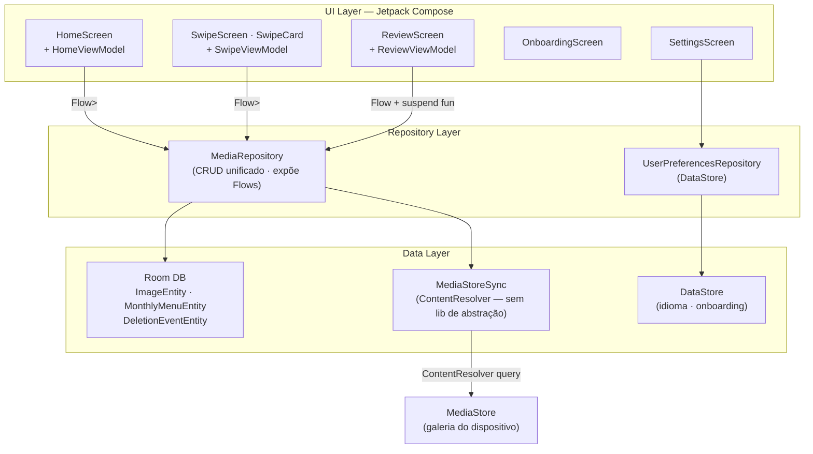

<div align="center">


# SwipeOut

**Limpe sua galeria como você usa o Tinder.**

[](https://developer.android.com)
[](https://kotlinlang.org)
[](https://developer.android.com/jetpack/compose)
[](LICENSE)

</div>

---

## O que é

SwipeOut é um app Android de limpeza de galeria com interface de swipe. Você revisa suas fotos e vídeos **mês a mês**: desliza para a direita para manter, para a esquerda para deletar, ou marca com bookmark para decidir depois. Ao concluir o mês, um único dialog do sistema confirma todas as deleções e libera espaço.

O app é **100% offline** e **dark mode only** — sem telemetria, sem conta, sem nada que não seja você e sua galeria.

---

## Screenshots

<p align="center">
  
  
  
  
  
</p>

<p align="center">
  <a href="assets/Screenshots/6.mp4">▶ Ver demo em vídeo</a>
</p>

---

## Funcionalidades

- **Swipe com física natural** — `AnchoredDraggableState` + `exponentialDecay`, sem duração de animação fixa
- **Undo ilimitado** — pilha de histórico completa; volta até o primeiro card da sessão
- **Vídeo no card ativo** — ExoPlayer com `TextureView` no card do topo; thumbnails estáticos nos demais (zero alocação desnecessária)
- **Organização por mês** — cada mês vira uma entrada na home com cover, contagem e progresso
- **Filtro por álbum** — dropdown aparece automaticamente quando há 2+ álbuns com itens pendentes
- **Confirmação segura** — deleção via `MediaStore.createDeleteRequest` (Android 11+); um dialog do sistema, nenhum arquivo removido sem confirmação
- **Tracking de espaço** — bytes liberados por sessão, acumulados na home
- **Suporte a Android 8–14** — permissões adaptativas (READ_MEDIA_IMAGES/VIDEO no API 33+ vs READ_EXTERNAL_STORAGE nos anteriores)

---

## Stack

| Camada | Tecnologia |
|--------|-----------|
| Linguagem | Kotlin 2.0.0 |
| UI | Jetpack Compose (BOM 2024.09.03) · Material 3 |
| Injeção de dependência | Hilt 2.51.1 |
| Banco de dados | Room 2.6.1 (schema v3) |
| Imagens | Coil 3.0.4 |
| Vídeo | Media3 / ExoPlayer 1.4.1 |
| Navegação | Navigation Compose 2.8.3 |
| Preferências | DataStore 1.1.1 |
| Build | AGP 8.3.2 · Gradle 8.6 · KSP 2.0.0-1.0.22 |
| Min SDK | 26 (Android 8.0) |

---

## Arquitetura

SwipeOut segue **MVVM** com separação estrita em camadas. Toda a comunicação entre camadas é reativa via `Flow`/`StateFlow` — a UI nunca chama diretamente a camada de dados.



### Camada de dados

**Entidades Room**

| Entidade | Responsabilidade |
|----------|-----------------|
| `ImageEntity` | Item de mídia — `id`, `contentUri`, `monthKey`, `mimeType`, `isVideo`, `bucketId`, `bucketName`, `sizeBytes`, `width`, `height`, `durationMs`, `decision` (PENDING / KEEP / DELETE / BOOKMARK) |
| `MonthlyMenuEntity` | Resumo do mês — contagens por decisão, `isCompleted`, `coverUri` |
| `DeletionEventEntity` | Histórico de deleções — `timestamp`, quantidade deletada, bytes liberados |

**MediaStoreSync**

Sincronização via `ContentResolver` direto — sem biblioteca de abstração. Consulta `MediaStore.Files` com projeção explícita (id, dateAdded, size, mimeType, duration, width, height, bucketId, bucketName), preserva decisões existentes e faz upsert apenas de itens novos.

**Schema v3**

Adicionou `bucketId` / `bucketName` em cada imagem com índices dedicados. A migration v2→v3 faz backfill incremental via `ContentResolver` sem destruir dados existentes.

### Camada de UI

**HomeScreen**

`LazyColumn` de meses com pull-to-refresh, filtro por álbum em dropdown reativo (`flatMapLatest` no ViewModel) e cover art do mês. O dropdown só aparece quando há 2+ álbuns com itens pendentes.

**SwipeScreen + SwipeCard**

Stack de 3 cards simultâneos. A física de swipe usa `AnchoredDraggableState` + `exponentialDecay` — o card não tem duração de animação fixa; ele desacelera naturalmente como um objeto real. O overlay MANTER/DELETAR aparece proporcionalmente ao deslocamento via `graphicsLayer`. Vídeo roda normalmente durante arrasto e animações graças a um único `graphicsLayer` compartilhado.

**SwipeViewModel — Undo**

Pilha `List<LastSwipe>` completa. Cada swipe empilha a imagem e a direção; undo desempilha, reverte a decisão no Room e dispara animação de retorno no card (voa de fora da tela de volta ao centro).

**ReviewScreen**

Grid de decisões (keep/delete separados) com preview fullscreen. Botão de confirmação mostra contagem exata e MB a liberar. Deleção via `MediaStore.createDeleteRequest` — um único dialog do sistema.

**Componentes compartilhados**

- `MediaThumbnail` — foto usa `AsyncImage`/Coil; vídeo usa `VideoThumbnail` (primeiro frame via `MediaMetadataRetriever`, sem ExoPlayer)
- `TextureVideoPlayer` — ExoPlayer com `TextureView` para o card ativo no SwipeScreen; reprodução automática, loop e som
- `ProgressRing` — indicador circular de progresso

---

## Como rodar localmente

### Pré-requisitos

- Android Studio Ladybug (2024.2) ou superior
- JDK 17
- Dispositivo ou emulador com Android 8.0+ (API 26+)

### Passos

```bash
# 1. Clone o repositório
git clone https://github.com/seu-usuario/SwipeOutAndroid.git
cd SwipeOutAndroid

# 2. Abra no Android Studio ou rode via Gradle
./gradlew installDebug
```

> **Nota:** o app precisa de permissão de leitura da galeria. No primeiro acesso, o fluxo de onboarding conduz o usuário pela solicitação.

---

## Estrutura do projeto

```
app/src/main/kotlin/com/swipeout/
├── data/
│   ├── db/                         # Room: AppDatabase, DAOs, Entidades
│   ├── media/MediaStoreSync.kt     # Sync com ContentResolver
│   ├── repository/MediaRepository.kt
│   ├── preferences/UserPreferencesRepository.kt
│   └── di/DatabaseModule.kt        # Hilt: provê DB e DAOs
├── ui/
│   ├── common/                     # MediaThumbnail, ProgressRing
│   ├── home/                       # HomeScreen + HomeViewModel
│   ├── swipe/                      # SwipeScreen + SwipeCard + SwipeViewModel
│   ├── review/                     # ReviewScreen + ReviewViewModel
│   ├── settings/                   # SettingsScreen + SettingsViewModel
│   ├── onboarding/                 # OnboardingScreen + OnboardingViewModel
│   ├── navigation/                 # NavGraph + Screen
│   ├── strings/                    # AppStrings (i18n sem recursos XML)
│   └── theme/                      # Color, Theme, Type
├── MainActivity.kt
└── SwipeOutApplication.kt
```

---

## Decisões técnicas notáveis

**Kotlin nativo vs cross-platform**
Escolha deliberada pelo ecossistema Android nativo. Compose, Room e MediaStore dão acesso completo às APIs do sistema sem camada de abstração intermediária — relevante especialmente para a integração com MediaStore e as permissões adaptativas por versão de OS.

**Física de swipe sem duração fixa**
`AnchoredDraggableState` + `exponentialDecay` em vez de animações com `durationMillis`. O card desacelera de acordo com a velocidade real do gesto — mais natural e mais responsivo ao toque do usuário.

**Gestão de vídeo no Compose**
ExoPlayer só é alocado para o card do topo. Os demais usam `MediaMetadataRetriever` para extrair o primeiro frame — leve e sem custo de inicialização de player. Vídeo roda corretamente durante arrasto e animações via `graphicsLayer` unificado.

**Room migrations sem perda de dados**
A migration v2→v3 (adição de bucketId/bucketName) faz backfill incremental via `ContentResolver` em vez de destruir e recriar a tabela — preserva todas as decisões já tomadas pelo usuário.

---

## Licença

```
MIT License — veja LICENSE para detalhes.
```
